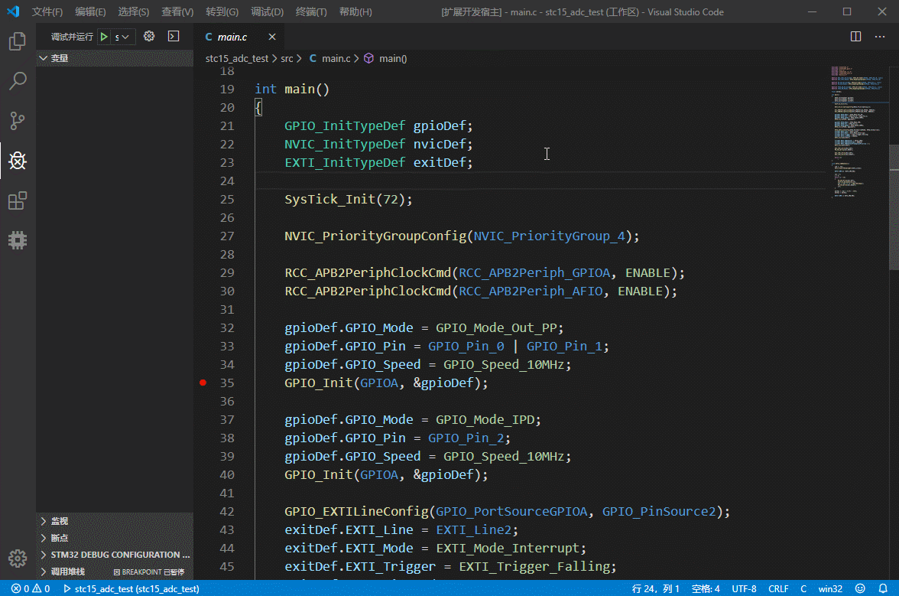
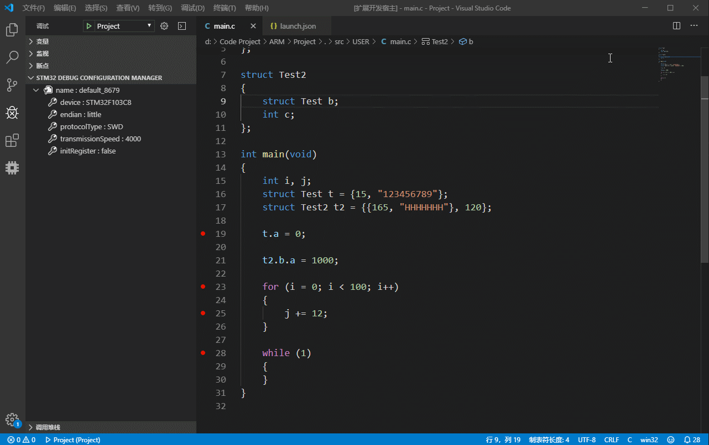
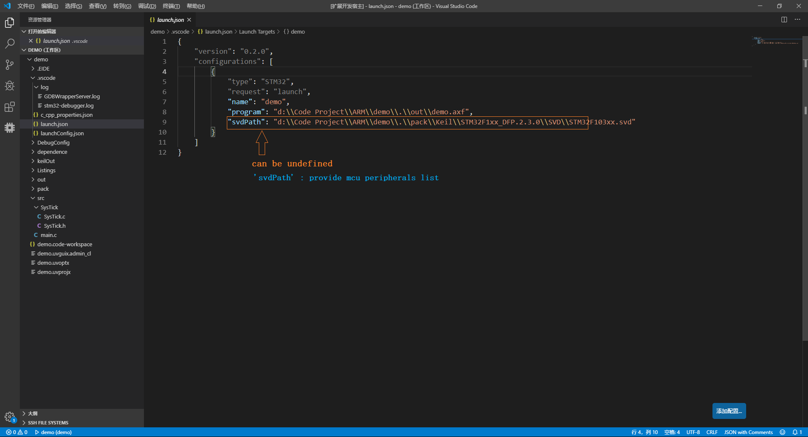

# STM32-Debugger

STM32-Debugger is a debugger for cortex-M chips.

`It should work with eide extension, but it can also work independently`

### Only for Windows platform

***

## Download

The extension package is too big (about 33 MB), so you can download vsix package from [github -> release](https://github.com/github0null/stm32-debugger/releases)

***

## Features

* Support `JLink` debugger, support more than `7000+` chips for STM32 chips

* Support `SWD` `JTAG` `cJTAG` `FINE` `ICSP` debug protocol

***

# Version Change

## v1.0.1

### Fixed

- file paths bug

### Add 

- Stop at the entrance of the main function

***

## v1.0.0 `Official Version`

### Fixed

- **fixed some bugs**

### Other

- **increase stability**

****

## v0.0.4

### Fixed

- **fixed some bugs**

- **fixed breakpoints bugs**

### Other

- **increase stability**

- **reduce vsix package size**

- **add command: `debugger.uploadLog`, now you can upload log to remote server**

***

## v0.0.3

- **fixed some bugs**

- **add peripheral view** 

***

## Show

**Device Connect**

***

**Launch.json**

***

**Function Show**

***
