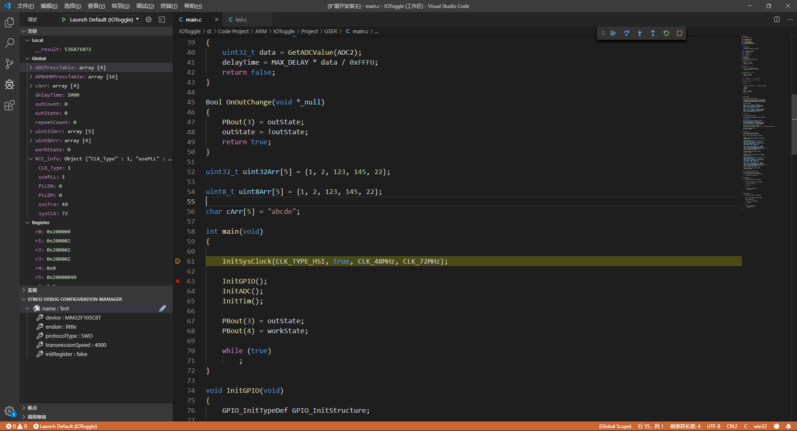

# STM32-Debugger

STM32-Debugger is a debugger for cortex-M chips.

`It should work with eide extension, but it can also work independently`

***

## Download

The extension package is too big (about 77 MB), so you can download vsix package from [github -> release](https://github.com/github0null/stm32-debugger/releases)

***

## Features

* Support `JLink` debugger, support more than `7000+` chips for STM32 chips

* Support `SWD` `JTAG` `cJTAG` `FINE` `ICSP` debug protocol

***

## Show

**Device Connect**

***

**Function Show**
